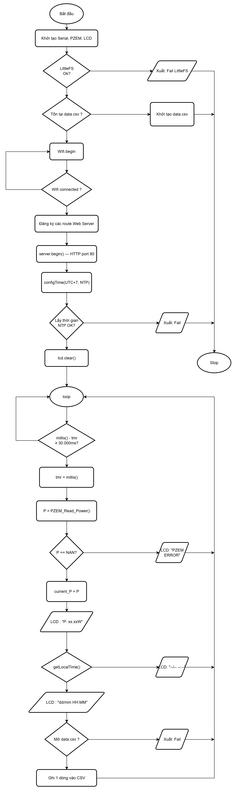

# ESP32 PZEM-016 Datalogger

Hệ thống đo lường và ghi nhật ký công suất điện sử dụng vi điều khiển ESP32 và cảm biến PZEM-016. Dữ liệu được lưu trữ nội bộ và quản lý thông qua giao diện web.

## 1. Tính năng
* **Đo lường:** Đọc công suất (W) từ PZEM-016 qua giao thức Modbus RS485.
* **Hiển thị:** Thể hiện trạng thái kết nối, địa chỉ IP, giờ NTP và công suất trên màn hình LCD 1602 I2C.
* **Datalogger:** Tự động lưu dữ liệu định dạng `.csv` vào bộ nhớ Flash (LittleFS) mỗi 30 giây.
* **Web UI:** Web Server bất đồng bộ cho phép xem dữ liệu trực tiếp dưới dạng bảng, tải xuống file `data.csv` và xóa dữ liệu lưu trữ.

## 2. Phần cứng
* ESP32 Development Board (ESP-WROOM-32)
* Module PZEM-016 (kèm CT dòng)
* Module giao tiếp RS485 to TTL
* Màn hình LCD 1602 kèm module I2C

## 3. Lưu đồ giải thuật



## 4. Cấu hình thư viện (PlatformIO)
Thêm đoạn mã sau vào file `platformio.ini`:

```ini
board_build.filesystem = littlefs
lib_deps =
    mathieucarbou/AsyncTCP @ ^3.3.2
    mathieucarbou/ESPAsyncWebServer @ ^3.6.0
    marcoschwartz/LiquidCrystal_I2C
```

## 5. Cài đặt và sử dụng

1. **Cấu hình mã nguồn:** Mở file `src/main.cpp` và thay đổi thông tin mạng WiFi:
   ```cpp
   const char* ssid = "TEN_WIFI";
   const char* password = "MAT_KHAU";
   ```
2. **Nạp dữ liệu (Web UI):**
   * Đặt file index.html vào thư mục data/ trong thư mục gốc của dự án.
   * Mở PlatformIO ➔ Project Tasks ➔ esp32dev ➔ Platform.
   * Chạy lần lượt lệnh Build Filesystem Image và Upload Filesystem Image.
3. **Nạp Firmware:** Nhấn lệnh Upload trên thanh công cụ PlatformIO để biên dịch và nạp mã C++ vào ESP32.
4. **Vận hành:**
   * Cấp nguồn cho thiết bị.
   * Đọc địa chỉ IP hiển thị trên màn hình thông qua UART với máy tính.
   * Truy cập địa chỉ IP qua trình duyệt web trên thiết bị cùng mạng WiFi để sử dụng bảng điều khiển.
